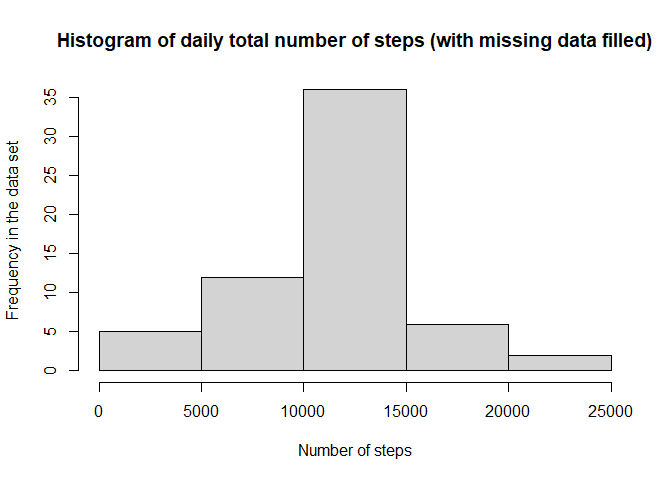

&nbsp;

##  **1.0 Introduction**

This study analyzes an individual's personal movement using data collected from 
an activity monitoring devices such as a Fitbit, Nike Fuelband, or Jawbone Up.  
The goal is to discover the activity pattern of the individual.

&nbsp;

## **2.0 Method**

The raw data used for this study is from this location 
[Activity monitoring data](https://d396qusza40orc.cloudfront.net/repdata%2Fdata%2Factivity.zip).We will process and clean up the raw data, and use the data to answer some 
specific questions regarding to the individual's activity patterns.  

&nbsp;

###  2.1.1 *Loading and preprocessing the data*

1. Load the required libraries, then download the raw data file from the data source.


```r
library(dplyr)
library("lattice")

fileUrl = "https://d396qusza40orc.cloudfront.net/repdata%2Fdata%2Factivity.zip"
download.file(fileUrl, destfile = "Activity.zip", method="curl")
unzip("Activity.zip")
```

2. Read the raw data into a data frame named "raw" in R studio, and do initial assessment of the data

```r
raw <- read.csv("activity.csv")
dim(raw)
```

```
## [1] 17568     3
```

3. Process/transform the data by removing the rows with missing data  

```r
data <- raw[complete.cases(raw), ]
dim(data)
```

```
## [1] 15264     3
```

&nbsp;

### 2.2 *Average daily steps*

1. Calculate the total number of steps taken each day

```r
bydate <- tapply(data$steps, data$date, sum)
dim(bydate)
```

```
## [1] 53
```

2. Make a histogram of the total number of steps taken each day

```r
hist(bydate, 
     main="Histogram of daily total number of steps",
     xlab="Number of steps", ylab="Frequency in the data set")
```

<!-- -->

3. Calculate the mean and median of the total number of steps taken per day

```r
sum_bydata <- summary(bydate)
sum_bydata
```

```
##    Min. 1st Qu.  Median    Mean 3rd Qu.    Max. 
##      41    8841   10765   10766   13294   21194
```
The calculated median is 10765 and the mean 10766. 

&nbsp;

### 2.3 *Average daily activity pattern*
1. Make a time series plot of the 5-minute interval (x-axis) and the average 
number of steps taken, averaged across all days (y-axis)


```r
byinterval <- tapply(data$steps, data$interval, mean)
plot(data$interval[1:288], byinterval, type = "l", col="blue",
     main="Average daily activity pattern",
     panel.first = grid(),
     xlab="Minutes of the day", ylab="Number of steps")
```

<!-- -->

2. Find the 5-minute interval, on average across all the days in the dataset, 
contains the maximum number of steps.

```r
byinterval[match(max(byinterval), byinterval)]
```

```
##      835 
## 206.1698
```
The interval with value 835 has the max number of steps, 206,1698, on average. 

&nbsp;


### 2.4 *Imputing missing values*


1. Calculate and report the total number of missing values in the dataset 


```r
colSums(is.na(raw))
```

```
##    steps     date interval 
##     2304        0        0
```
There are 2304 rows have missing "steps" data.


2. The strategy is to fill all of the missing values in the dataset with
mean "steps" of the day.  Let's first calculate the average steps for each day.


```r
daymean <- aggregate(raw$steps, by=list(raw$date), function(x){mean(x, na.rm=TRUE)})
colSums(is.na(daymean))
```

```
## Group.1       x 
##       0       8
```
The above data shows that there are 8 days, which are missing data for the entire day.  We will have to fill these 8 days with the mean of the entire data set. 
So we need to compute the mean of entire data set. 


```r
overallmean <- mean(raw$steps, na.rm=TRUE)
```

3.Create a new dataset that is equal to the original dataset but with the 
missing data filled in.  The following are the steps to fill in the missing data.

- Create column "steps2", which contains the average "steps" of each day. 
- The missing values in the column "step2" will be filled with data set average value "overallmean".   
- Then use cloumn "step2" to fill the missing values in column "steps".
- Remove column "step2", after the work is completed. 


```r
fn_mean <- function(x){mean(x, na.rm=TRUE)}
fn_replace_na <- function(x, y){ifelse(!is.na(x), x, y)}
data_no_na <- raw %>% 
              group_by(date) %>% 
              mutate(steps2 = fn_mean(steps)) %>% 
              mutate(steps2 = fn_replace_na(steps2, overallmean)) %>% 
              mutate(steps = fn_replace_na(steps, steps2)) %>%
              select(-steps2)
dim(data_no_na)             
```

```
## [1] 17568     3
```

```r
colSums(is.na(data_no_na))
```

```
##    steps     date interval 
##        0        0        0
```
The above results shows that all "NA" has been replaced.

4. Make a histogram of the total number of steps taken each day


```r
bydate_no_na <- tapply(data_no_na$steps, data_no_na$date, sum)
hist(bydate_no_na, 
     main="Histogram of daily total number of steps (with missing data filled)",
     xlab="Number of steps", ylab="Frequency in the data set")
```

<!-- -->

5. Calculate and report the mean and median total number of steps taken per day. 

```r
sum_bydata_no_na <- summary(bydate_no_na)
rbind(sum_bydata, sum_bydata_no_na)
```

```
##                  Min. 1st Qu.   Median     Mean 3rd Qu.  Max.
## sum_bydata         41    8841 10765.00 10766.19   13294 21194
## sum_bydata_no_na   41    9819 10766.19 10766.19   12811 21194
```
The above table compares the results between have the NA filled or unfilled.
The mean is same, the median is slightly different. For this data set, the 
impact of imputing missing data is not significant.  

&nbsp;

### 2.5 *Differences in activity patterns between weekdays and weekends*

1. Create a new factor variable in the dataset with two levels – “weekday” and 
“weekend” indicating whether a given date is a weekday or weekend day.


```r
fn_weekend <- function(x){
  ifelse(weekdays(as.Date(x)) %in% c("Saturday", "Sunday"), "weekend", "weekday")
}
data_no_na <- mutate(data_no_na, weekdayOrweekend = fn_weekend(date))          
byinterval <- aggregate(x = data_no_na$steps,                
                        by = list(data_no_na$interval, data_no_na$weekdayOrweekend),
                        FUN = mean) 
head(byinterval)
```

```
##   Group.1 Group.2        x
## 1       0 weekday 7.006569
## 2       5 weekday 5.384347
## 3      10 weekday 5.139902
## 4      15 weekday 5.162124
## 5      20 weekday 5.073235
## 6      25 weekday 6.295458
```

Plot by weekday or weekend

```r
xyplot(x ~ Group.1 | Group.2 , data=byinterval, layout = c(1, 2),
       type = "l", lty = 1:3, col = "blue",
       xlab="Minutes in a day",
       ylab="Average number of steps taken each day",
       main="Average daily activity pattern weekday vs. weekend")
```

<!-- -->

&nbsp;


### 2.6 Tool Information

The following shows the hardware and software information of the computer used 
for this analysis:


```r
sessionInfo()
```

```
## R version 4.0.1 (2020-06-06)
## Platform: x86_64-w64-mingw32/x64 (64-bit)
## Running under: Windows 10 x64 (build 18362)
## 
## Matrix products: default
## 
## locale:
## [1] LC_COLLATE=English_United States.1252  LC_CTYPE=English_United States.1252   
## [3] LC_MONETARY=English_United States.1252 LC_NUMERIC=C                          
## [5] LC_TIME=English_United States.1252    
## 
## attached base packages:
## [1] stats     graphics  grDevices utils     datasets  methods   base     
## 
## other attached packages:
## [1] dplyr_1.0.0     knitr_1.28      lattice_0.20-41 ggplot2_3.3.2  
## 
## loaded via a namespace (and not attached):
##  [1] Rcpp_1.0.4.6     rstudioapi_0.11  magrittr_1.5     tidyselect_1.1.0 munsell_0.5.0   
##  [6] colorspace_1.4-1 R6_2.4.1         rlang_0.4.6      stringr_1.4.0    tools_4.0.1     
## [11] grid_4.0.1       gtable_0.3.0     xfun_0.14        tinytex_0.23     withr_2.2.0     
## [16] htmltools_0.4.0  ellipsis_0.3.1   yaml_2.2.1       digest_0.6.25    tibble_3.0.1    
## [21] lifecycle_0.2.0  crayon_1.3.4     purrr_0.3.4      vctrs_0.3.1      glue_1.4.1      
## [26] evaluate_0.14    rmarkdown_2.2    stringi_1.4.6    compiler_4.0.1   pillar_1.4.4    
## [31] generics_0.0.2   scales_1.1.1     pkgconfig_2.0.3
```

&nbsp;

